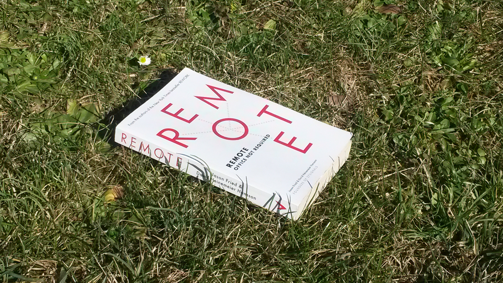

:title: Office Not Required
:author: Nicolas Ferrari, alwaysdata
:description: A presentation about working remotely
:data-transition-duration: 1500
:css: custom.css

----

:id: title

Office Not Required
===================

A presentation about working remotely.

2015/02 • Toulon, France

----

:id: author

Author
======

Nicolas Ferrari, co-founder of alwaysdata.com_.

Working remotely for 2 years.

.. _alwaysdata.com: https://alwaysdata.com

.. note::

    alwaysdata creation

    remote working objective

    Italy

    I speak with my personal XP

----

:id: remote
:data-rotate: 90

Remote?
=======

----

:id: calafuria

.. image:: images/calafuria.jpg
    :width: 860px

Calafuria (Toscana, Italy)

.. note::

    Branson ITW on Necker Island (seen at Salon des Entrepreneurs)

----

:id: book

Remote, Office Not Required

Jason Fried & David Heinemeier Hansson

Founders of 37Signals

.. note::

    Worker-side presentation (not employer)

    No multinational subjects like taxes

----

:id: missing-upgrade

*“The missing upgrade is for the human mind.”*
==============================================

See open-source softwares as a great example.

.. note::

    open-source / commercial softwares: high scale Internet collaboration

    +73% in US between 2005 and 2011

    2014: Marissa Meyer (Yahoo!) and Michael Bloomberg

    Techno OK

----

:id: pros
:data-rotate: -90

Pros
====

----

:id: freedom

Freedom
=======

Work hours

Change

Travel

Family

----

:id: drink

----

:id: work

Work
====

Work is what matters

Work doesn't happen at work

Less distractions

Less meetings & managers

↪ Trust ↩
---------

.. note::

    Judge only work (not hours, or some1 on FB)

    Don't work 4 some1 who doesn't trust you

    No babysitting

----

:id: health

Health
======

Ergonomics (choose your desk)

“Your Commute Is Killing You”

*“According to the research, commuting is associated with an increased risk of obesity, insomnia, stress, neck and back pain, high blood pressure, and other stress-related ills such as heart attacks and depression, and even divorce.”*

(Annie Lowrey, `Slate, 2011 <http://www.slate.com/articles/business/moneybox/2011/05/your_commute_is_killing_you.html>`_)

.. note::

    ergo: desk, chair, posture (standing?)

----

:id: more-pros

And more...
===========

Ecological

Timezones

.. note::

    Business reaching different countries

----

:id: changes
:data-y: r1800
:data-rotate-x: 180

Changes
=======

More responsabilities and commitment

Communication: asynchronous, telephone, etc.

New distractions: compute different, move!

Loneliness: move!

Stay healthy: move, I said!

↪ Find your routine! ↩
----------------------

.. note::

    Responsabilities: not to procrastinate & to define boundaries

    Manage async com: instant msg? email? meeting? write more doc.

    Tel: organize and use SIP

    Distractions (give examples): private room, multiple devices

    Move: parks, wifi outside, coffee shops, coworking, etc.

    Your routine: eat, clothes, crowd noise if you need, work mornings or evenings

----

:id: tools
:data-rotate: -90

Tools
=====

A culture to prepare early!

Chat (Slack_/Hipchat_, IRC, Jabber, etc.)

Project Management Sofware

Video calls (Google Hangout, Skype, etc.)

Screen/Code sharing

.. _Slack: https://slack.com/
.. _Hipchat: https://www.hipchat.com/

.. note::

    Prepare early: early adoption like young kids and devices we dont had

----

:id: conclusion
:data-rotate-y: 180
:data-scale: 3
:data-x: r-3500
:data-y: r3500

*“In thirty years' time, as technology moves forward even further, people are going to look back and wonder why offices ever existed”*
======================================================================================================================================

Richard Branson, founder of Virgin Group

----

:id: thankyou

Thank you!
==========

nicolasferrari.fr_ • `@ferrouzzz <https://twitter.com/ferrouzzz>`_

alwaysdata.com_ • `@alwaysdata <https://twitter.com/alwaysdata>`_

.. _nicolasferrari.fr: http://nicolasferrari.fr
.. _alwaysdata.com: https://alwaysdata.com
